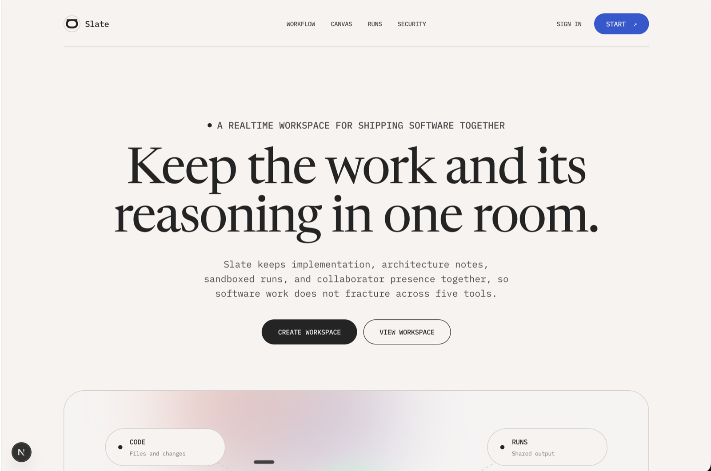
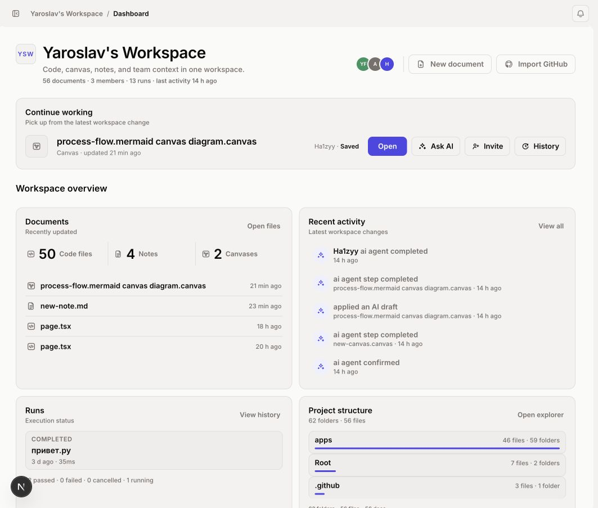
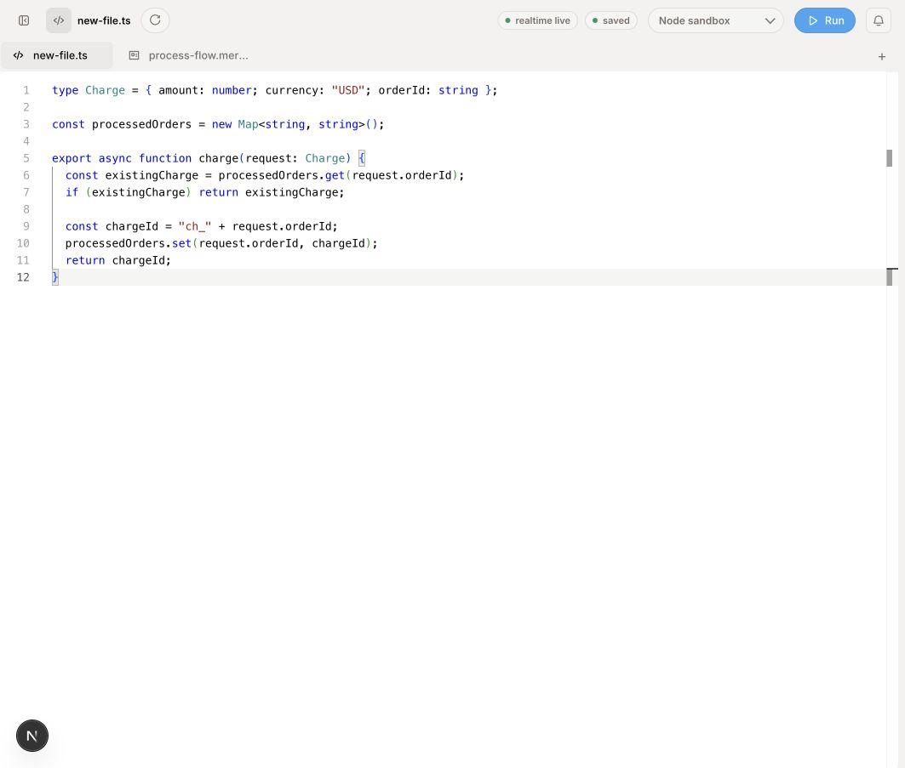
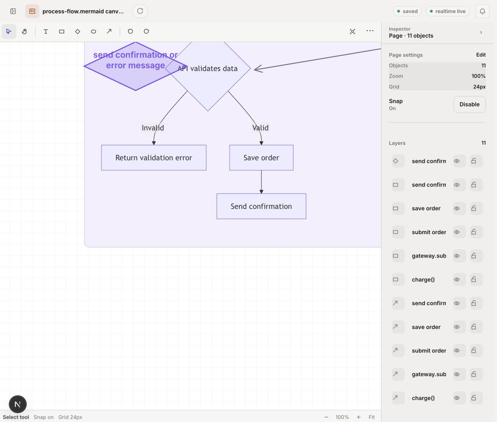
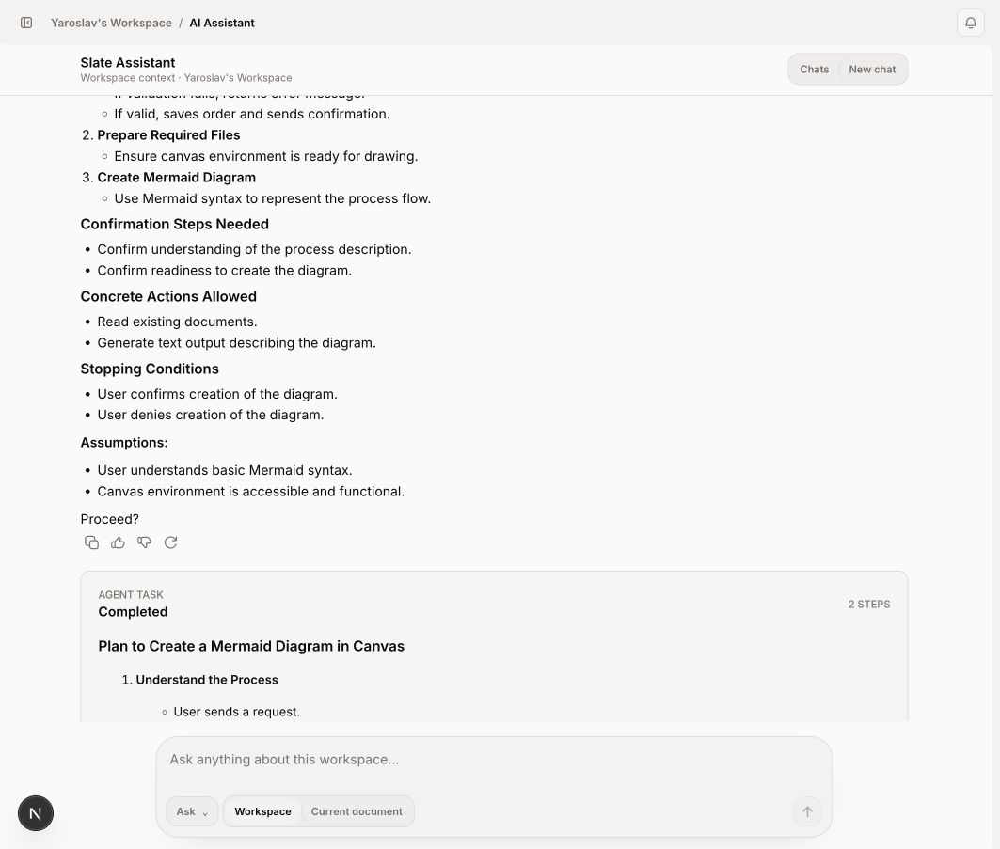
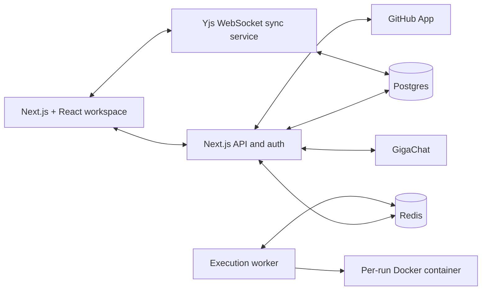

# Slate

> A realtime workspace for software teams that keeps code, architecture, execution evidence, source control, and AI-assisted drafts in one shared room.

Slate is a full-stack collaborative developer workspace. It replaces the fragmented loop of editor, whiteboard, terminal output, repository browser, and chat context with a single persistent workspace where a team can reason about a change, implement it together, run it safely, and preserve the result.

## Why Slate

Software work loses context as it moves between tools. A diagram is separated from the files it describes, terminal output disappears after a run, and the decision behind a change is difficult to reconstruct later.

Slate makes the workspace itself the source of truth:

- Code, notes, and native diagrams live in the same document model.
- Multiple people edit and see presence in realtime.
- Runs are queued, isolated, and attached to shared activity.
- AI proposes reviewable drafts instead of silently changing a workspace.
- GitHub repositories can be imported, inspected, edited, committed, and pushed through an owner-controlled GitHub App connection.

## Product tour

Every portfolio image below is captured from the running Slate application. The gallery intentionally shows distinct product surfaces rather than mocked concept screens.

### Landing page



The public product page explains Slate's single-room workflow and leads directly into the realtime workspace experience.

### Workspace dashboard



The dashboard keeps the active document, workspace activity, execution status, project structure, GitHub connection state, and collaboration entry points in one place.

### Collaborative code editor



The editor combines a Monaco code surface with document tabs, persisted realtime state, a selected execution sandbox, and a direct Run action.

### Native architecture canvas



The canvas is a first-class realtime document with shapes, connectors, layers, selection tools, inspector controls, zoom, grid, and export actions.

### AI Draft workflow



AI can inspect authorized workspace context, explain a plan, create a draft, and hand the result back through an explicit review and Apply boundary.

The expanded capture roadmap, including responsive, GitHub, execution, and additional collaboration views, is in [docs/portfolio-screenshots.md](docs/portfolio-screenshots.md).

| Surface | What it demonstrates |
| --- | --- |
| Landing page | Product positioning, realtime workflow, native canvas, shared runs, and security posture. |
| Workspace dashboard | Workspace health, document inventory, member access, activity, and GitHub connection state. |
| Code editor | Monaco editing, collaborative presence, Yjs-backed state, document navigation, and execution entry point. |
| Native canvas | Shapes, connectors, selection, group movement and resize, alignment, export, and realtime canvas state. |
| AI panel | Workspace-aware answers, structured drafts, Mermaid and canvas diagrams, diff review, and explicit Apply. |
| GitHub Sync | Owner-controlled GitHub App connection, repository import, tracked files, review, commit, and push. |
| Collaboration controls | In-app invitations, workspace roles, member management, blocking, ownership protection, and activity history. |

## What is implemented

### Workspace and collaboration

- Registration, login, sessions, onboarding, and email-verification policy controls.
- Workspace creation, switching, and settings.
- In-app invitations for existing accounts.
- Owner, editor, and viewer roles with workspace-scoped permissions.
- Member removal, workspace-local blocking, and guarded ownership transfer.
- Workspace activity records and audit events.
- Command palette, document navigation, responsive workspace shell, light and dark themes.

### Realtime code and documents

- Monaco code editor with language-aware editing.
- Yjs documents synchronized through a dedicated WebSocket sync service.
- Awareness and collaborator presence.
- Persistent document snapshots stored in Postgres.
- Code files, notes, folders, and canvas documents in one workspace tree.
- Markdown rendering with GFM support and sanitization.
- Concurrent-edit protection for AI-proposed document updates.

### Native architecture canvas

- Native SVG canvas rather than an embedded third-party whiteboard.
- Shapes, text, connectors, colors, labels, and inspector controls.
- Marquee selection, additive selection, multi-shape movement, and group resize.
- Locked-shape handling, duplicate, delete, align, bring-to-front, and send-to-back actions.
- Pan, zoom, minimap, selection bounds, and contextual toolbar controls.
- SVG and PNG export in the browser.
- Persistent and realtime-synchronized canvas documents.

### AI-assisted work

- Server-side GigaChat integration with credentials scoped to the web runtime.
- Workspace-aware answers that can read permitted workspace documents.
- Reviewable drafts for code, notes, GFM tables, and native canvas diagrams.
- Mermaid-to-canvas preview and diagram generation.
- Bounded diff preview before document changes.
- Live Yjs content-hash check before Apply, so concurrent changes are never overwritten silently.
- Explicit Draft + Apply boundary: AI does not mutate a workspace without a human decision.

### GitHub workflow

- Owner-controlled GitHub App connection for private repositories.
- Repository selection and import into a Slate workspace.
- Tracked-file status and explicit manual sync.
- Reviewable commit boundary before pushing changes.
- GitHub App installation scope prevents ordinary members from connecting repositories for the workspace.
- Local Git Bridge remains available for local development workflows.

### Execution

- Queued execution jobs backed by Redis and BullMQ.
- Dedicated execution worker separated from the web process.
- Node execution inside a per-run Docker container.
- Run state, output, exit status, and activity association.
- Health endpoints for the web application, sync service, and execution worker.

### Messenger module

Messenger is implemented as a separately gated module and is intentionally disabled in the default product path. It is not presented as a live portfolio workflow.

- Workspace conversations, direct messages, reactions, receipts, unread state, and access checks.
- WebSocket notification gateway with an outbox model and short-lived grants.
- Encrypted-at-rest message content and key rotation support.
- Attachment storage, validation, malware scanning, preview generation, and cleanup lifecycle.
- Opt-in AI extraction pipeline and workspace draft handoff.
- Feature flags, health endpoints, smoke tests, load checks, and production runbook.

## Architecture



The architecture deliberately separates the services with distinct risk profiles:

- The web application owns authentication, workspace access, API routes, persistence orchestration, and product UI.
- The sync service maintains long-lived realtime connections and persists collaborative Yjs state.
- The execution worker consumes queued jobs and isolates user code from the product shell.
- Messenger realtime and media processing are separate opt-in services because notification delivery and file inspection have different operational constraints.

For the detailed model, see [architecture](docs/architecture.md), [realtime model](docs/realtime-model.md), [execution model](docs/execution-model.md), and [security model](docs/security-model.md).

## Technology

| Area | Stack |
| --- | --- |
| Web application | Next.js 16, React 19, TypeScript |
| UI | Custom Slate design system, SVG UI primitives, Hugeicons |
| Code editing | Monaco Editor, `y-monaco` |
| Realtime collaboration | Yjs, `y-protocols`, WebSocket, dedicated Node sync service |
| Data | PostgreSQL, Prisma |
| Queues and fanout | Redis, BullMQ, ioredis |
| Execution | Node worker, Docker per run |
| AI | GigaChat, server-only credentials, Mermaid |
| Repository integration | GitHub App, GitHub API, local Git Bridge |
| Storage and media | S3-compatible storage, MinIO locally, Sharp, ClamAV |
| Validation | TypeScript, Node test runner, ESLint, production builds |
| Local infrastructure | Docker Compose |

## Repository map

```text
apps/
  web/                       Next.js product application
services/
  sync/                      Realtime Yjs WebSocket service
  execution/                 Redis-backed Docker execution worker
  messenger-realtime/        Opt-in Messenger notification gateway
  messenger-media/           Opt-in attachment validation and preview worker
docs/
  architecture.md            System boundaries and product loop
  realtime-model.md          Yjs synchronization and persistence model
  execution-model.md         Queue and isolation model
  security-model.md          Security boundaries and operations
  github-app.md              GitHub App setup and repository access model
  messenger/                 Gated Messenger implementation and runbook
scripts/
  dev.mjs                    Local stack launcher
```

## Security and product boundaries

- Workspace access is role-based and enforced server-side.
- Tokens, GitHub credentials, and AI credentials remain server-side.
- The GitHub connection is owner-controlled and installation-scoped.
- Execution is separated from the web process and runs in a Docker container.
- AI output is a draft until a user explicitly applies it.
- Realtime document state is scoped to authorized workspace members.
- Messenger remains disabled until its independent production gates are satisfied.

Slate does not claim to be a completed enterprise platform. Advanced organizations, billing, multi-region operation, fully hardened public execution, and Messenger production rollout remain intentionally separate workstreams. The current delivery priority is a strong collaborative workspace loop with honest operational boundaries.

## Run locally

### Prerequisites

- Node.js 24+
- Docker Desktop
- npm

Install each service once:

```bash
npm --prefix apps/web install
npm --prefix services/sync install
npm --prefix services/execution install
npm --prefix services/messenger-realtime install
npm --prefix services/messenger-media install
```

Start the core stack:

```bash
npm run dev
```

This starts Postgres and Redis, generates Prisma clients, applies local migrations, and starts the web app, sync service, and execution worker. Open [http://localhost:3000](http://localhost:3000).

Messenger infrastructure is intentionally opt-in:

```bash
npm run dev:messenger
```

Stop local infrastructure:

```bash
npm run dev:down
```

## Verify the project

```bash
npm --prefix apps/web run typecheck
npm --prefix apps/web test
npm --prefix apps/web run build
node scripts/smoke-server.mjs
```

The server smoke checks health endpoints, registration, workspace creation, document creation, realtime authorization, run creation, and worker completion after the local stack is available.

## Important configuration

- GitHub App setup: [docs/github-app.md](docs/github-app.md)
- GitHub production sync: [docs/GITHUB_SYNC.md](docs/GITHUB_SYNC.md)
- Database workflow: [docs/database.md](docs/database.md)
- AI credentials: `apps/web/.env.example`
- Messenger production operations: [docs/messenger/08-production-runbook.md](docs/messenger/08-production-runbook.md)

Never commit `.env`, GitHub App private keys, provider credentials, or production storage keys.

## Current roadmap

The next product milestones are:

1. General CI and release discipline for the full web application.
2. Public HTTPS deployment and production GitHub App configuration.
3. Stronger execution isolation, cancellation, streamed output, and resource limits.
4. GitHub webhook-driven automatic sync.
5. Persistent canvas group entities and richer workspace organization.
6. Organizations, billing, advanced permissions, observability, and multi-region operations.

## Documentation

- [Architecture](docs/architecture.md)
- [Design system](docs/design-system.md)
- [Realtime model](docs/realtime-model.md)
- [Execution model](docs/execution-model.md)
- [Security model](docs/security-model.md)
- [GitHub App](docs/github-app.md)
- [Git Sync](docs/git-sync.md)
- [Messenger overview](docs/messenger/00-overview.md)
- [Portfolio screenshot brief](docs/portfolio-screenshots.md)

## License

This repository is private and not licensed for redistribution.
